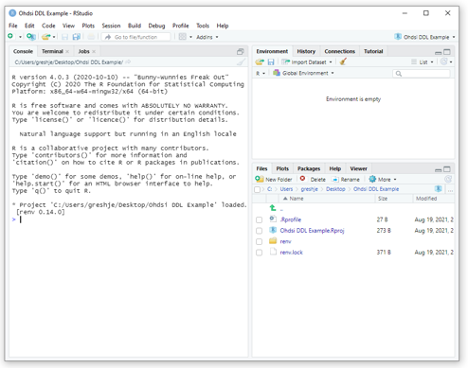
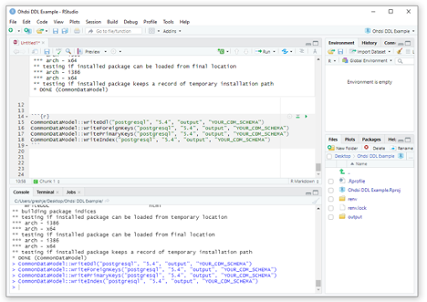
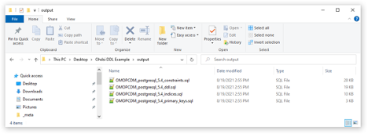

# How to Use this Repository

If you are looking for information on how to submit a bugfix, skip to the [next section](https://github.com/OHDSI/CommonDataModel#bug-fixesmodel-updates)

## Generating the DDLs
*By John and Sam Gresh*

If you prefer to generate the DDLs on your own without downloading them from the github tags, these instructions will guide you on how to do so.

### Introduction

This module will demonstrate how to individually create the DDL scripts for DDL, foreign keys, primary keys, and indexed for a single database instance at a time.  This module is intended for end users that wish to generate these scripts from R without the need to clone or download the source code from github.  The scripts that are created through this process are available as zip files here (TODO: NEED LINK).  

#### Dependencies and prerequisites

This process required R-Studio to be installed as well as [DatabaseConnector](https://github.com/ohdsi/DatabaseConnector) and [SqlRender](https://github.com/ohdsi/SqlRender). 

#### Create DDL, Foreign Keys, Primary Keys, and Indexes from R

Launch R-Studio and create a new project: File -> New Project -> New Directory -> New Project

After completing this step you should see something like the following:



For the next step, you can either open a new R script (File -> New File -> R Script), paste the text in the console, or open an R notebook (File -> New File -> New R Notebook). Whatever you choose, paste the following, replacing "output" with the name of the output file where you want the DDLs to appear and "YOUR_CDM_SCHEMA" with the name of your CDM schema. In this example we are generating the postgresql DDLs by specifying the dialect in the function calls. To determine which dialects are supported, run the `CommonDataModel::listSupportedDialects()` function.

```{r}
if (!require("devtools")) install.packages("devtools")
devtools::install_github("OHDSI/CommonDataModel", "v5.4")

CommonDataModel::buildRelease("postgresql", "5.4", "output", "YOUR_CDM_SCHEMA")

```





You will then see something like the above, with your output directory created and the DDLs available in the folder you specified. 

## Bug Fixes/Model Updates

**NOTE** This information is for the maintainers of the CDM as well as anyone looking to submit a pull request. If you want to suggest an update or addition to the OMOP Common Data Model itself please open an [issue](https://github.com/OHDSI/CommonDataModel/issues) using the proposal template. The instructions contained herein are meant to describe the process by which bugs in the DDL code should be addressed and/or new versions of the CDM are produced. 

*Just looking for the latest version of the CDM and you don't care about the R package? Please visit the [releases tab](https://github.com/OHDSI/CommonDataModel/tags) and download the latest. It will include the DDLs for all currently supported versions of the CDM for all supported SQL dialects.* 

Typically, new CDM versions and updates are decided by the CDM working group (details to join meetings on [homepage](https://ohdsi.github.io/CommonDataModel/)). These changes are tracked as issues in the [github repo](https://github.com/OHDSI/CommonDataModel/issues). Once the working group decides which changes make up a version, all the corresponding issues should be tagged with a version number, e.g. v5.4, and added to a project board. 

## Step 0

**Changes to the model structure** should be made in the representative csv files by adding, subtracting, or renaming fields or tables. ETL conventions are not currently tracked by CDM version unless they are conventions specific to new fields (for example CONDITION_STATUS was added in v5.3 which specifies the way in which primary condition designations should be captured). 

**Bug fixes** are made much the same way using the csv files, but they should be limited to typos, primary/foreign key relationships, and formatting (like datetime vs datetime2). 

## Step 1

If you are making **changes to the model structure** request a new branch in the CommonDataModel repository for the new version of the CDM you are creating. Then, fork the repository and clone the newly made branch. If you are **squashing bugs** fork the repository and clone the master branch.

### Step 1.1 
For **changes to the model structure**, rename the table level and field level inst/csv files from the current released version to the new version. For example, if the new version you are creating is v5.4 and the most recent released version is v5.3, rename the csv files named "OMOP_CDMv5.3_Field_Level.csv" and "OMOP_CDMv5.3_Table_Level.csv" to "OMOP_CDMv5.4_Field_Level.csv" and "OMOP_CDMv5.4_Table_Level.csv". These files serve multiple functions; they serve as the basis for the CDM DDL, CDM documentation, and Data Quality Dashboard (DQD). You can read more about the DQD [here](https://ohdsi.github.io/DataQualityDashboard/index.html). 

For **squashing bugs** make the necessary changes in the csv file corresponding to the major.minor version you are fixing. For example, if you are working on fixes to v5.3.3 you would make changes in the v5.3 files. (skip to step 2)

### Step 1.2
The csv files can now be updated with the changes and additions for the new CDM version. If a new table should be added, add a line to the *Table_Level.csv* with the table name and description and list it as part of the CDM schema. The remaining columns are quality checks that can be run. Details [here](https://ohdsi.github.io/DataQualityDashboard/index.html) on what those are. After adding any tables, make any changes or additions to CDM fields in the *Field_Level.csv*. The columns are meant to mimic how a DDL is structured, which is how it will eventually be generated. A yes in the field *isRequired* indicates a NOT NULL constraint and the datatype field should be filled in exactly how it would look in the DDL. Any additions or changes should also be reflected in the userGuidance and etlConventions fields, which are the basis for the documentation. **DO NOT MAKE ANY CHANGES IN THE DDL ITSELF**. The structure is set up in such a way that the csv files are the ground truth. If changes are made in the DDL instead of the csv files then the DDL will be out of sync with the documentation and the DQD. 

## Step 2
Once all changes are made the csvs, rebuild the package and then open `extras/codeToRun.R`. To make sure that your new version is recognized by the package run the function `listSupportedVersions()`. If you do not see it, make sure your new csv files are in inst/csv and that you have rebuilt the package. Once you have confirmed that the package recognizes your new version, run the function `buildRelease()`. You should now see a file in inst/ddl for your new version. 

**NOTE ABOUT CDM v6.0**
====================

Please be aware that v6.0 of the OMOP CDM is **not** fully supported by the OHDSI suite of tools and methods. The major difference in CDM v5.3 and CDM v6.0 involves switching the \*_datetime fields to mandatory rather than optional. This switch radically changes the assumptions related to exposure and outcome timing. Rather than move forward with v6.0, please transform your data to [CDM v5.4](https://github.com/OHDSI/CommonDataModel/releases/tag/v5.4) until such time that we as a community have fully defined the role of dates vs datetimes both when it comes to the model and the evidence we generate. 
