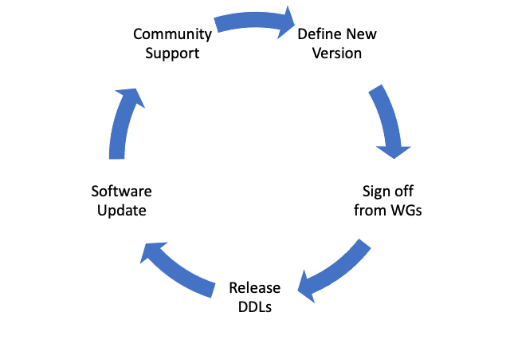

The OMOP Common Data Model is managed by the [OHDSI CDM Working Group](https://www.ohdsi.org/web/wiki/doku.php?id=projects:workgroups:cdm-wg). Through the end of 2019 and into 2020 our goal was to fully update the documentation in an effort to facilitate greater understanding of the model. Almost every [forum post](https://www.forums.ohdsi.org) relating to a question on how to map data into the CDM inevitably referenced the (now outdated) technical and difficult-to-understand explanations of the tables and fields currently on the wiki. To remedy we focused on one or two tables each month, diving fully into the user guidance and ETL specifications. The results of our efforts can be seen on the pages detailing [v5.3](https://ohdsi.github.io/CommonDataModel/cdm531.html) and [v6.0](https://ohdsi.github.io/CommonDataModel/cdm60.html).

In addition to documentation the formal remit of the CDM Working Group (WG) is to hear proposals for change, ratifying only those with valid use cases and data to support them. In the past, this was done by the WG alone. The group would invite others from around the community to present use cases for change and suggestions for improvement. The WG would then vote on the proposals and a new CDM version would be released after a certain period of time or if enough proposals were voted in. This approach worked when the community was smaller but as it is growing rapidly the CDM WG needed to adapt the refresh cycle such that everyone has an opportunity to weigh in on the proposed changes. 

## CDM Refresh Cycle

### 1. Define New Version

The image above describes the new CDM refresh cycle. It begins with **defining a new version**. This has been completed for the current cycle. Issues and proposals on the github were considered during a 4-hour workshop where it was decided the next CDM version will be CDM v5.4, building off of CDM v5.3. The group then participated in a rapid-fire voting activity to identify which changes should be incorporated into CDM v5.4. Any items that were not unanimously agreed upon were then discussed in small groups to hone the proposal and suggestions were presented back to the group. The final roadmap for CDM v5.4 can be found [here](https://github.com/OHDSI/CommonDataModel/projects/3).

### 2. Sign off from Work Groups

This is the current stage of the refresh cycle for CDM v5.4. Each member of the CDM WG is a liaison for another workgroup in the community. They are responsible for presenting the proposed changes to the CDM and collecting the feedback. This has resulted in very helpful suggestions from the EHR, Data Quality, Device, HADES, and ACHILLES groups. This outreach has proven to be very effective and should result in a very stable version.

### 3. Release DDLs

After all changes and suggestions are agreed upon by the community and work groups the next step is to generate the DDLs this will be done by the CDM Development group.

### 4. Software Update

There will be period of time once the DDLs are ready to allow the software and methods developers to prepare for the official release of the CDM. This is meant to serve as a buffer so that once the community starts adopting the new model, the tools and methods will be ready to support it.

### 5. Community Support

This is the final stage of the CDM refresh cycle. Once the DDLs are ready and the software and tools supports the new version, the CDM WG will work to help the community convert their data to the new model. 

# CDM WG Meeting Information

The CDM working group meets the first and third Tuesday of the month. See below for links to the meetings. 

**Every first Tuesday of the month at 1pm est** [Teams Meeting](https://teams.microsoft.com/l/meetup-join/19%3a133f2b94b86a41a884d4a4d160610148%40thread.tacv2/1601910741972?context=%7b%22Tid%22%3a%22a30f0094-9120-4aab-ba4c-e5509023b2d5%22%2c%22Oid%22%3a%2281c21b6d-448d-4634-abbc-6b0962d1138a%22%7d)   

**Every third Tuesday of the month at 1pm est** [Teams Meeting](https://teams.microsoft.com/l/meetup-join/19%3a133f2b94b86a41a884d4a4d160610148%40thread.tacv2/1611000164347?context=%7b%22Tid%22%3a%22a30f0094-9120-4aab-ba4c-e5509023b2d5%22%2c%22Oid%22%3a%223c193b7f-c2ab-4bcf-b88c-f89a6b1fba38%22%7d)

**Note** These were recently changed from a Skype meeting to a Microsoft Teams meeting. If you do you have access to the OHDSI Teams Tenet, please contact Clair Blacketer at mblacke@its.jnj.com.

### CDM WG Important Links

- [Google Drive Location](https://drive.google.com/open?id=1DaNKe6ivIAZPJeI31VJ-pzNB9wS9hDqu)
- [Running Agenda](https://docs.google.com/document/d/1WgKePjrI_cGdqn2XQCe1JdGaTzdMqU4p5ihkMt8fcAc/edit?usp=sharing)
- [CDM Github](https://github.com/OHDSI/CommonDataModel)
- [Process for adopting CDM and Vocabulary changes](https://www.ohdsi.org/web/wiki/doku.php?id=documentation:next_cdm:cdm_process)
