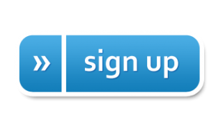

```{r setup, include=FALSE}
library(tidyverse)
library(magrittr)
library(toastui)
```

The Observational Medical Outcomes Partnership (OMOP) Common Data Model (CDM) is an open community data standard, designed to standardize the structure and content of observational data and to enable efficient analyses that can produce reliable evidence. A central component of the OMOP CDM is the OHDSI standardized vocabularies. The OHDSI vocabularies allow organization and standardization of medical terms to be used across the various clinical domains of the OMOP common data model and enable standardized analytics that leverage the knowledge base when constructing exposure and outcome phenotypes and other features within characterization, population-level effect estimation, and patient-level prediction studies. 

This website is meant to serve as a resource describing the specification of the available versions of the Common Data Model. This includes the structure of the model itself and the agreed upon conventions for each table and field as decided by the OHDSI Community. The vocabulary tables are part of the model and, as such, are detailed here. To download the vocabulary itself, please visit [https://athena.ohdsi.org](https://athena.ohdsi.org). For more information about the OHDSI suite of tools designed to implement best practices in characterization, population-level effect estimation and patient-level prediction, please visit [https://ohdsi.github.io/Hades/](https://ohdsi.github.io/Hades/).

## The CDM Working Group

The CDM is managed by the OHDSI CDM Working Group. If you would like to join our group please fill out [this form](https://forms.office.com/Pages/ResponsePage.aspx?id=lAAPoyCRq0q6TOVQkCOy1ZyG6Ud_r2tKuS0HcGnqiQZUOVJFUzBFWE1aSVlLN0ozR01MUVQ4T0RGNyQlQCN0PWcu) and check "Common Data Model" to be added to our Microsoft Teams environment. This working group endeavors to maintain the OMOP CDM as a living model by soliciting and responding to requests from the community based on use cases and research purposes. For more information on the CDM refresh process please see the description [here](http://ohdsi.github.io/CommonDataModel/cdmRefreshProcess.html). You will find information on our meetings and links to join at the end of this page. 

### Calendar 

This is the calendar of events for the CDM Working Group, including upcoming topics and links to meetings. If you would like to present to the group regarding a new use case for the OMOP CDM or if you would like the group's assistance with a problem you are having, please fill out our sign-up form.

[{width=15%}](https://www.signupgenius.com/go/10C0948AEAD28A4F9CF8-workgroup)

**Note** If you do you have access to the OHDSI Teams Tenet, either contact Clair Blacketer at mblacke@its.jnj.com or fill out [this form](https://forms.office.com/Pages/ResponsePage.aspx?id=lAAPoyCRq0q6TOVQkCOy1ZyG6Ud_r2tKuS0HcGnqiQZUOVJFUzBFWE1aSVlLN0ozR01MUVQ4T0RGNyQlQCN0PWcu) and check "Common Data Model"

```{r echo=FALSE, message=FALSE, warning=FALSE}

calendarData <- read.csv("images/cdm_wg_calendar.csv")

calendar(calendarData, navigation = TRUE, defaultDate = Sys.Date()) %>%
  cal_month_options(
    startDayOfWeek  = 1, 
    narrowWeekend = TRUE
  ) %>% 
  cal_props(cal_demo_props())
```


## Current CDM Version

The current CDM version is [CDM v5.4](http://ohdsi.github.io/CommonDataModel/cdm54.html), depicted below. This CDM version was developed over the course of a year by considering requests that were sent via our [issues page](https://github.com/OHDSI/CommonDataModel/issues). The list of proposed changes was then shared with the community in multiple ways: through discussions at the weekly OHDSI Community calls, discussions with the OHDSI Steering Committee, and discussions with all potentially affected workgroups. The [final changes](http://ohdsi.github.io/CommonDataModel/cdm54Changes.html) were then delivered to the Community through a new R package designed to dynamically generate the DDLs and documentation for all supported SQL dialects. Looking for an entity-relationshop diagram? Click [here](http://ohdsi.github.io/CommonDataModel/cdm54erd.html)!

- [Link to DDLs for CDM v5.4](https://github.com/OHDSI/CommonDataModel/tree/v5.4.0/inst/ddl/5.4)
- [Link to ReadMe for instructions on how to use the R package](https://github.com/OHDSI/CommonDataModel/tree/master#readme)


<br>

### Current Support for CDM v5.4

The table below details which OHDSI tools support CDM v5.4. There are two levels of support: legacy support means that the tool supports all tables and fields that were present in CDM v5.3 and feature support indicates that the tool supports any new tables and fields in CDM v5.4 that were not present in CDM v5.3. A green check `r emo::ji("white heavy check mark")` indicates that the support level for the listed tool is in place, has been tested, and released. A warning sign `r emo::ji("warning")` indicates that the support level for the listed tool has been initiated but has not yet been tested and released. 
<br>


|**Tool**|**Description**|**Legacy Support**|**Feature Support**|
|--|--|--|--|
|**CDM R package**|This package can be downloaded from [https://github.com/OHDSI/CommonDataModel/](https://github.com/OHDSI/CommonDataModel/). It functions to dynamically create the OMOP CDM documentation and DDL scripts to instantiate the CDM tables. |`r emo::ji("white heavy check mark")`|`r emo::ji("white heavy check mark")`
|**Data Quality Dashboard**|This package can be downloaded from [https://github.com/OHDSI/DataQualityDashboard](https://github.com/OHDSI/DataQualityDashboard). It runs a set of > 3500 data quality checks against an OMOP CDM instance and is required to be run on all databases prior to participating in an OHDSI network research study.|`r emo::ji("white heavy check mark")`| `r emo::ji("warning")`
|**Achilles**|This package can be downloaded from [https://github.com/OHDSI/Achilles](https://github.com/OHDSI/Achilles), performing a set of broad database characterizations agains an OMOP CDM instance. |`r emo::ji("white heavy check mark")`|`r emo::ji("warning")`
|**ARES**|This package can be downloaded from [https://github.com/OHDSI/Ares](https://github.com/OHDSI/Ares) and is designed to display the results from both the ACHILLES and DataQualityDashboard packages to support data quality and characterization research.|`r emo::ji("white heavy check mark")`|`r emo::ji("warning")`
|**ATLAS**|ATLAS is an open source software tool for researchers to conduct scientific analyses on standardized observational data. [Demo](http://atlas-demo.ohdsi.org/) |`r emo::ji("white heavy check mark")`|`r emo::ji("warning")`
|**Rabbit-In-A-Hat**|This package can be downloaded from [https://github.com/OHDSI/WhiteRabbit](https://github.com/OHDSI/WhiteRabbit) and is an application for interactive design of an ETL to the OMOP Common Data Model with the help of the the scan report generated by White Rabbit.|`r emo::ji("white heavy check mark")`|`r emo::ji("white heavy check mark")`
|**Feature Extraction**|This package can be downloaded from [https://github.com/OHDSI/FeatureExtraction](https://github.com/OHDSI/FeatureExtraction). It is designed to generate features (covariates) for a cohort generated using the OMOP CDM. |`r emo::ji("white heavy check mark")`|`r emo::ji("white heavy check mark")`*
|**Cohort Diagnostics**|This package can be downloaded from [https://github.com/OHDSI/CohortDiagnostics](https://github.com/OHDSI/CohortDiagnostics) and is used to critically evaluate cohort phenotypes. |`r emo::ji("white heavy check mark")`|`r emo::ji("warning")`
<br>
\* The **Feature Extraction** package supports all relevant new features in CDM v5.4. For example, it was decided that, from a methodological perspective, the EPISODE and EPISODE_EVENT tables should not be included to define cohort covariates because the events that make up episodes are already pulled in as potential covariates.

<br>

### CDM WG Important Links

- [Google Drive Location](https://drive.google.com/open?id=1DaNKe6ivIAZPJeI31VJ-pzNB9wS9hDqu)
- [Running Agenda](https://docs.google.com/document/d/1WgKePjrI_cGdqn2XQCe1JdGaTzdMqU4p5ihkMt8fcAc/edit?usp=sharing)
- [CDM Github](https://github.com/OHDSI/CommonDataModel)
- [Process for adopting CDM and Vocabulary changes](http://ohdsi.github.io/CommonDataModel/cdmRefreshProcess.html)
