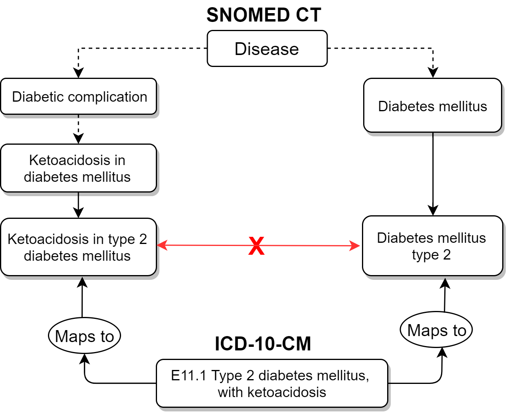
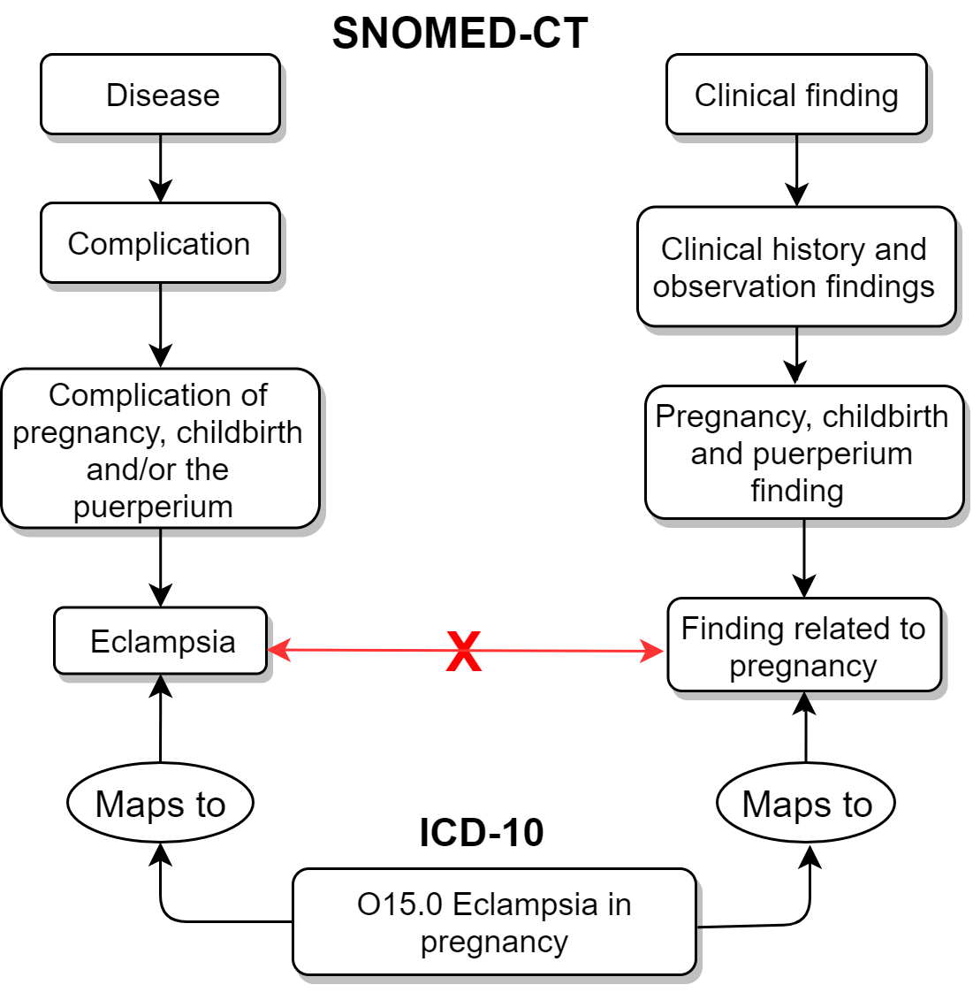

# Mapping of Concepts 

**Mapping**, also known as **a map**, is an association between a particular concept in one code system or dataset and code in another, rarely the same, code system that has the same (or similar) meaning.
Also, **Mapping** is the process to transform one concept into a Standard one. 
The Standardized Clinical Data Tables allow only Standard Concepts, thus all other codes used in the source databases have to be translated to Standard Concepts.
Mapping is done through records in the CONCEPT_RELATIONSHIP table. They connect each Concept to a Standard Concept through a number of special RELATIONSHIP_IDs:

|Relationship ID| Purpose | Features|
|------|--------------|----------------|
| **Maps to**        | Mapping a Source Concept to a Standard Concept to be placed into the following fields of Standardized Clinical Data Tables   **condition_concept_id**  **observation_concept_id** **measurement_concept_id** **drug_concept_id** **procedure_concept_id** **device_concept_id**  Note, that this relationship is also used for mapping of concepts to populate **value_as_concept_id** | - Stands for either a full equivalence or an “uphill” mapping (mapping to a more general semantic category)  - Can be single or multiple for each Source Concept  |
| **Maps to value**  | A special mapping between a Source Concept and a Standard Concept to be placed into the **value_as_concept_id** field of the MEASUREMENT and OBSERVATION tables| - Points to a concept, indicating the value of Measurements or content of Observations   - Is used only in combination with a single “Maps to” |

## "Maps to" Relationships 

  * Concepts participating in the “Maps to” mapping are Source (Non-standard) Concepts and Standard Concepts. 
  * The mapping always attempts to reflect the semantics of a Source Concept by an Equivalent Standard Concept. 
  * Equivalent carries the same meaning, covers the same semantic space, and, importantly, has the same parents and children in the hierarchy (if there are any) as well. If an equivalent Concept is not available, the mapping matches to a more generic Standard Concept(s). This ensures that a query in the target vocabulary will retrieve the same records as if they were queried in the original source vocabulary.
  * Source Concepts are mapped or may be mapped to one or several Standard Concepts. If they are mapped to more than one Standard Concept, in the resulting CDM table, there is more than one record for each record in the source.
  * Standard Concepts are also mapped to Standard Concepts via "Maps to", this is a mapping to itself.
  * If there are 2 or more similar Standard concepts in the OMOP vocabulary, please, report about it at the [OHDSI Forum](https://forums.ohdsi.org/c/vocabulary-users) and unless it is fixed, as the first-line choice, use LOINC for Measurements and SNOMED for everything else.
  * If there are 2 similar Standard concepts within SNOMED, look at the domain (Morphologic abnormality is an Observation, Clinical finding is a Condition), revise attributes and hierarchy of both concepts (its number, fullness, and correctness). It is not necessary to compare the amount of relationships/children precisely, just verify that all seems appropriate and the hierarchy is rich enough. If it does for both concepts, then choose concepts belonging to SNOMED International (short concept codes) rather than SNOMED US/UK Editions (long concept codes). If the length of concept codes is identical, then choose the one with a smaller number of concept_id.

**Note!** Classification Concepts (standard_concept='C') do not have a mapping to a Standard Concept.

### Examples of usage:

**Single  “Maps to” for mapping to an Equivalent Standard Concept**

|Source  Concept Code |Source Concept Name|Relationship ID |Standard Concept ID|Standard Concept Code|Standard Concept Name |
|---|----|----|----|---|----|
| M65.3                                                                                                               | Trigger finger                                                                         | Maps to          | 763891               | 448251000124102        | Trigger finger                                                                                   |
| A06                                                                                                                 | Amebiasis                                                                              | Maps to          | 438959               | 111910009              | Amebic infection                                                                                 |

**Single  “Maps to” for mapping to a Non-equivalent Standard Concept**   

|Source  Concept Code |Source Concept Name|Relationship ID |Standard Concept ID|Standard Concept Code|Standard Concept Name |
|---|----|----|----|---|----|
| D46.5                                                                                                               | Refractory anaemia with multi-lineage dysplasia                                        | Maps to          | 4003185              | 109996008              | Refractory anemia                                                                                |
| M81.50                                                                                                              | Idiopathic osteoporosis, multiple sites                                                | Maps to          | 81390                | 3345002                | Idiopathic osteoporosis                                                                          |

**Multiple “Maps to” for mapping to several Standard Concepts fully covering semantic space of a Source Concept** 

|Source  Concept Code |Source Concept Name|Relationship ID |Standard Concept ID|Standard Concept Code|Standard Concept Name |
|---|----|----|----|---|----|
| S61.1                                                                                                               | Open wound of finger(s) with damage to nail                                            | Maps to          | 4054063              | 125653000              | Open wound of finger                                                                             |
|                                                                                                                  |                                                                                     | Maps to          | 4167909              | 275320004              | Injury of nail                                                                                   |
| I26.0                                                                                                               | Pulmonary embolism with mention of acute cor pulmonale                                 | Maps to          | 440417               | 59282003               | Pulmonary embolism                                                                               |
|                                                                                                                  |                                                                                     | Maps to          | 312927               | 49584005               | Acute cor pulmonale                                                                              |
| G44.311                                                                                                             | Acute post-traumatic headache, intractable                                             | Maps to          | 42535403             | 290431000119101        | Intractable headache following trauma                                                            |
|                                                                                                                  |                                                                                     | Maps to          | 44782681             | 122751000119105        | Acute posttraumatic headache                                                                     |

**Multiple “Maps to” for mapping to several Standard Concepts partially covering semantic space of a Source Concept**

|Source  Concept Code |Source Concept Name|Relationship ID |Standard Concept ID|Standard Concept Code|Standard Concept Name |
|---|----|----|----|---|----|
| V01.11                                                                                                              | Pedestrian on roller-skates injured in collision with pedal cycle in traffic accident  | Maps to          | 442247               | 215142005              | Pedal cycle accident involving collision between pedal cycle and pedestrian, pedestrian injured  |
|                                                                                                                  |                                                                                     | Maps to          | 441188               | 32906002               | Victim, pedestrian in vehicular AND/OR traffic accident                                          |
| T36.1x4                                                                                                             | Poisoning by cephalosporins and other beta-lactam antibiotics, undetermined            | Maps to          | 4303975              | 419347003              | Poisoning by antibacterial drug                                                                  |
|                                                                                                                  |                                                                                     | Maps to          | 4055774              | 242975003              | Poisoning of undetermined intent by drug                                                         |

## "Maps to value" Relationships 

To preserve the meaning of Source concepts indicating values of Measurements or content of Observations, “Maps to” are complemented with a comprehensive set of “Maps to value” relationships.  Such mappings are considered to be equivalent. There are the following semantic groups of Source concepts which are mapped in such a way:

  - Conditions indicating abnormal levels of tests
  - Encounter for a procedure and an aftercare
  - Conditions resulting from the use of devices
  - Need for an immunization
  - Personal history of a condition
  - Family history of a condition
  - Personal history of medical treatment or procedure
  - Status of a transplant/prosthesis presence
  - Patient encounter procedures, not carried out

**Examples of usage:**

|Case #  |Source Concept Code  |Source Concept Name |Relationship ID | Standard Concept Code | Standard Concept Name | Standard Concept Domain ID |
|----|-----|-----|-----|----|-----|----|
| 1       | R77.0                | Abnormality of albumin                                                                     | Maps to          | 26758005               | Albumin measurement                                             | Measurement                 |
|      |                   |                                                                                         | Maps to value    | 263654008              | Abnormal                                                        | Spec Disease Status         |
| 2       | Z47.0                | Follow-up care involving removal of fracture plate and other internal fixation device      | Maps to          | 390906007              | Follow-up encounter                                             | Observation                 |
|      |                   |                                                                                         | Maps to value    | 72010008               | Removal of internal fixation device                             | Procedure                   |
| 3       | Y71                  | Cardiovascular devices associated with adverse incidents                                   | Maps to          | 269691005              | Medical accidents to patients during surgical and medical care  | Observation                 |
|      |                   |                                                                                         | Maps to value    | 303476002              | Cardiovascular equipment                                        | Device                      |
| 4       | Z23.2                | Need for immunization against tuberculosis [BCG]                                           | Maps to          | 723620004              | Requires vaccination                                            | Observation                 |
|      |                   |                                                                                         | Maps to value    | 42284007               | BCG vaccination                                                 | Procedure                   |
| 5       | Z86.4                | Personal history of psychoactive substance abuse                                           | Maps to          | 417662000              | History of clinical finding in subject                          | Observation                 |
|      |                   |                                                                                         | Maps to value    | 91388009               | Psychoactive substance abuse                                    | Condition                   |
| 6       | Z84.1                | Family history of disorders of kidney and ureter                                           | Maps to          | 416471007              | Family history of clinical finding                              | Observation                 |
|      |                   |                                                                                         | Maps to value    | 443820000              | Disorder of kidney and/or ureter                                | Condition                   |
| 7       | Z92.2                | Personal history of long-term (current) use of other medicaments                           | Maps to          | 416940007              | Past history of procedure                                       | Observation                 |
|      |                   |                                                                                         | Maps to value    | 266713003              | Long-term drug therapy                                          | Procedure                   |
| 8       | Z96.3                | Presence of artificial larynx                                                              | Maps to          | 416940007              | Past history of procedure                                       | Observation                 |
|      |                   |                                                                                         | Maps to value    | 27926003               | Construction of artificial larynx                               | Procedure                   |
| 9       | Z53.2                | Procedure not carried out because of patient's decision for other and unspecified reasons  | Maps to          | 416237000              | Procedure not done                                              | Observation                 |
|      |                   |                                                                                         | Maps to value    | 105480006              | Refusal of treatment by patient                                 | Observation                 |

## "Losses" in Mapping 

**1. The hierarchical discrepancy between Source and Standard Vocabularies**

It is not uncommon for heavily pre-coordinated Concepts (complex and fine-grained Concepts that are combinations of different dimensions). The coordination depends on the structure of the topology of the vocabularies from and to which the Concept is mapped. If they are not equivalent, no direct mapping can be established. But in order to maintain the ability to retrieve these Concepts when searching using hierarchical Concepts, two or more mappings are provided instead.

For example, in ICD-10-CM diabetic complications are a part of the disorder of Diabetes Mellitus, while in SNOMED Diabetes Mellitus and its complications reside in distinct hierarchical branches.

As another example, ICD-10 codes indicating complications of pregnancy are in the chapter of "Pregnancy, childbirth and the puerperium" that has a semantic relation to the fact of pregnancy, while in SNOMED denoting pregnancy conditions and their complications are in the separate hierarchical branches. 

The solution for both examples is to map Non-standard concepts to several standard ones. Even though there is no distinct equivalent in SNOMED, hierarchical queries will retrieve the correct records.

**2. Missing Source Concept equivalent**

This is possible due to the following reasons:

**Vague formulation of a Source Concept**

| source concept code | source concept name | relationship ID  | standard concept ID  | standard concept code  | standard concept name |
|----|-----|-----|------|------|-----|
| M99.9                                                                   | Biomechanical lesion, unspecified                                       | Maps to          | 4244662              | 928000                 | Disorder of musculoskeletal system      |
| A28.9                                                                   | Zoonotic bacterial disease, unspecified                                 | Maps to          | 432545               | 87628006               | Bacterial infectious disease            |

**Source Concept excessive granularity** 

| source concept code | source concept name | relationship ID  | standard concept ID  | standard concept code  | standard concept name |
|----|-----|-----|------|------|-----|
| B33.4                                                                   | Hantavirus (cardio-)pulmonary syndrome [HPS] [HCPS]                     | Maps to          | 441784               | 359761005              | Disease due to Hantavirus               |
| I12.9                                                                   | Hypertensive renal disease without renal failure                        | Maps to          | 201313               | 38481006               | Hypertensive renal disease              |
| S06.4x9                                                                 | Epidural hemorrhage with loss of consciousness of unspecified duration  | Maps to          | 4306943              | 82999001               | Epidural hemorrhage                     |
|                                                                      |                                                                      | Maps to          | 372448               | 419045004              | Loss of consciousness                   |
| S35.415                                                                 | Laceration of left renal vein                                           | Maps to          | 4124868              | 234084003              | Venous laceration                       |
|                                                                      |                                                                      | Maps to          | 195125               | 5753006                | Injury of renal vein                    |

**Classification difference between Source and Standard Vocabularies** 

| source concept code | source concept name | relationship ID  | standard concept ID  | standard concept code  | standard concept name |
|----|-----|-----|------|------|-----|
| I48                                                                     | Atrial fibrillation and flutter                                         | Maps to          | 4068155              | 17366009               | Atrial arrhythmia                       |
| G06.0                                                                   | Intracranial abscess and granuloma                                      | Maps to          | 4181187              | 363176004              | Inflammatory disorder of head           |
| J38.0                                                                   | Paralysis of vocal cords and larynx                                     | Maps to          | 4233244              | 89927005               | Paralysis of larynx                     |
| U82.1                                                                   | Resistance to methicillin                                               | Maps to          | 37017452             | 713728002              | Drug resistance to antibacterial agent  |

**Other possible issues that one could encounter:** 

  * Mapping has to exist and it can be built, but it is missing. Please report to [the OHDSI Forum](https://forums.ohdsi.org/), so it can be added.
  * Code irrelevant to the patient, for example, ICD-9-CM V65 “Other persons seeking consultation”
  * Source code is ill-defined, for example, ICD-9-CM 799 “Other ill-defined and unknown causes of morbidity and mortality”

## RULES FOR CONDITION MAPPING 
In general, Conditions are records suggesting the presence of a disease or medical condition stated as a diagnosis, a sign or a symptom. However, there are a lot of conditions that are not originating in the biological function of the human body but still require medical attention. Or they are true Conditions, but not at the time of the recording (History of) or in the person itself (Family history of). The mapping rules for these are as follows:

**Aftercare after procedures.**
Those are mapped to a single concept 413467001 "Aftercare", and with a second "Maps to value" relationship to the adequate procedure. For example, ICD10CM Z47.1 "Aftercare following joint replacement surgery" maps to both 413467001 "Aftercare" and to the procedure 4189532 "Implantation of joint prosthesis". Note that "Aftercare" is itself not a condition, but belongs to the Observation Domain.

**Late effects or sequelae of other conditions.**
If possible, these are mapped to single concepts describing them as such late effects. For example, ICD10CM  S82.874S concept_id 45589204 "Nondisplaced pilon fracture of right tibia, sequela" is mapped to 197150 "Late effect of fracture of lower extremities". The Domain is Condition.

**History of a condition.**
These are conditions, but not at the time of the condition_start_date. Therefore, they are mapped to the Concept 4214956 "History of clinical finding in subject", which is in the Observation Domain. The condition itself is recorded through the "Maps to value" relationship. For example, ICD10CM Z87.820 concept_id "Personal history of traumatic brain injury" maps to 4214956 "History of clinical finding in subject" and with "Maps to value" 4132546 "Traumatic brain injury".

**Family history of a condition.**
These, too, have a dual mapping to 4167217 "Family history of clinical finding" and a to the actual condition through a "Maps to value" relationship. For example, ICD10/ICD10CM Z80.0 concept_id 45542462 "Family history of malignant neoplasm of digestive organs" maps to 4167217 "Family history of clinical finding" as well as 443568 "Malignant neoplasm of the gastrointestinal tract". 

**History of medical treatment.**
Similarly, these are mapped to Observation Concept 4207283 "History of drug therapy", and through a "Maps to value" link to the actual therapy. For example, ICD10 Z92.0 concept_id 45605174 "Personal history of contraception" goes to 4207283 "History of drug therapy" history of drug therapy and 4027509 "Contraception". If the exact Ingredient or Clinical/Branded Drug is known, the map would direct to these Drug Concepts. But that is not typical.

**Adverse effect of medication.**
If possible, these are mapped to a direct equivalent. However, that usually does not exist, and then they are treated as the above history of medical treatments. For example, both ICD10CM T36.8X5A concept_id 45551127 "Adverse effect of other systemic antibiotics, initial encounter" and T36.8X5D "Adverse effect of other systemic antibiotics, subsequent encounter" map to 437191 "Antibacterial drug adverse reaction", while ICD10CM T36.8X5S concept_id 45560654 "Adverse effect of other systemic antibiotics, sequela" maps to 4207283 "History of drug therapy".

**Underdosing of medication.**
This information is handled similarly to the adverse effects, and the equivalent SNOMED concepts generally do not exist. For example, ICD10CM T36.0X6A concept_id 45565479 "Underdosing of penicillins, initial encounter" and T36.0X6D concept_id 45565480 "Underdosing of penicillins, subsequent encounter" go to 40488434 "Medication dose too low", while T36.0X6S concept_id 45565481 "Underdosing of penicillins, sequela" points at 4207283 "History of drug therapy".

**Status of organ absence or transplant/prosthetic presence.**
Absent organs are due to a procedure having removed them (unless they are inborn conditions, which are mapped as such). Therefore, they are mapped to 4215685 "Past history of procedure" and the appropriate procedure that removed the organ through a "Maps to value" link. For example, ICD10CM Z94.0 concept_id 35225404 "Kidney transplant status" maps to 4215685 "Past history of procedure" and 4322471 "Transplant of kidney". Z95.5 concept_id 35225418 "Presence of coronary angioplasty implant and graft" is pointed to 4215685 "Past history of procedure" and 4184832 "Coronary angioplasty". 

**Pre-coordinated Concepts listing two or more semantic components through AND or OR.**
These concepts are treated with the following order of precedence:

  -  To an equivalent combination concept that is also hierarchically well connected
  -  To both components separately
  -  To the most common ancestor

Examples for these 3 possibilities are:

  - ICD10 A01 concept_id 45576225 "Typhoid and paratyphoid fevers" has a single "Maps to" relationship to 4022808 "Human typhoid AND/OR paratyphoid fever".
  - IC10CM F12.22 concept_id 45591098 "Cannabis dependence with intoxication" has two "Maps to" relationships to 4052690 "Cannabis intoxication" and 440387 "Cannabis dependence".
  - ICD10 L02.0 concept_id 45596354 "Cutaneous abscess, furuncle and carbuncle of face" has a single "Maps to" relationship_id to 400082007 Disorder of skin of head.

**Maternal care.**
Many conditions require attention not because of a condition of a pregnant woman but of the fetus. However, all such conditions are being mapped to the mother anyway. For example, ICD10 O35.6 concept_id 45567927 "Maternal care for (suspected) damage to fetus by radiation" has two "Maps to" relationships to 199553006 "Fetus with radiation damage" and 289908002 "pregnancy". Both conditions are recorded with the mother.

**Need for immunization.**
These Concepts are mapped to an Observation indicating such an immunity gap. A second mapping with the relationship_id "Maps to value" is then directed to the Condition (represented as a SNOMED Concept) the immunization is inoculating against. Note that it is not mapped to the vaccine itself (which would be represented as a RxNorm Concept). For example, ICD10 Z23 concept_id 45556822 "Need for immunization against single bacterial diseases" maps to 170536002 "Vaccination required" and maps to value 87628006 "Bacterial infectious disease". 

**Conditions indicating abnormal levels of a test.**
These are split into the Measurement and result Concepts. For example, ICD10 R77.1 concept_id 45553745 "Abnormality of globulin" has a "Maps to" relationship to the Measurement 4353510 "Globulin measurement" and a "Maps to value" relationship to 4135493 "Abnormal".

**Conditions resulting from the use of Devices.**
Adverse or other outcomes of the exposure to a device are mapped to 473023007 "Complication associated with device and with another "Maps to value" relationship to the device itself, if possible. For example, ICD10 Y73.0 concept_id 45590664 "Gastroenterology and urology devices associated with adverse incidents, diagnostic and monitoring devices" has a "Maps to value" link to 45767866 "Gastro-urological device".

## CONDITION MAPPING ALGORITHM

